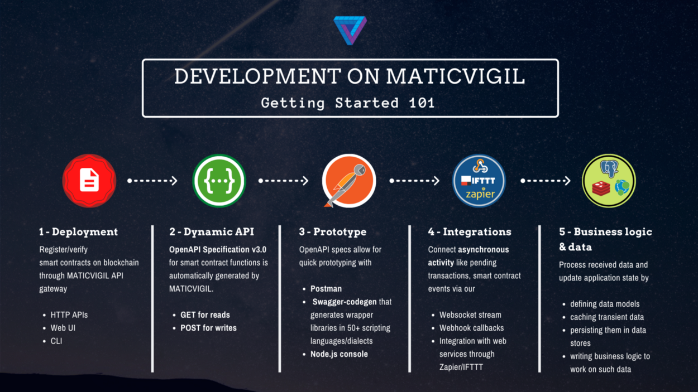

## Overview of Matic and reasons for its use

1. The current decentralized eco-system lacks usability and convenience and transactions are slow, expensive and complex. Many blockchain applications haven’t reached a stage of mass usage due to scalability and UI issues.
2. Matic Network is a Layer 2 scaling solution that achieves scale by utilizing side chains for off-chain computation while ensuring asset security using the Plasma framework and a DPoS validators.
3. MaticVigil API is an API gateway on top of the Matic network EVM-compatible sidechain which enables developers to write code to interact with value transfer and transactions on Matic as if it were just talking to a normal web server REST API over HTTP.
4. Due to the primitive nature of web3 libraries in Dart, I have chosen to use Matic to deploy and communicate with the smart contract.

###### Source: https://medium.com/blockvigil/maticvigil-scalable-blockchain-api-for-everyone-2bc09489e602
